 

<h3><code>dirga@github ~ $ whoami</code></h3>

I'm <strong>Dirga Yuditama</strong>, someone who enjoys building with code and turning ideas into interactive digital experiences. 
I love exploring different areas in tech. I use  btw...

 
 

 
 

 

<h3><code>dirga@github ~ $ playerctl metadata</code></h3>

<h3><code>dirga@github ~ $ ./links.sh</code></h3>

